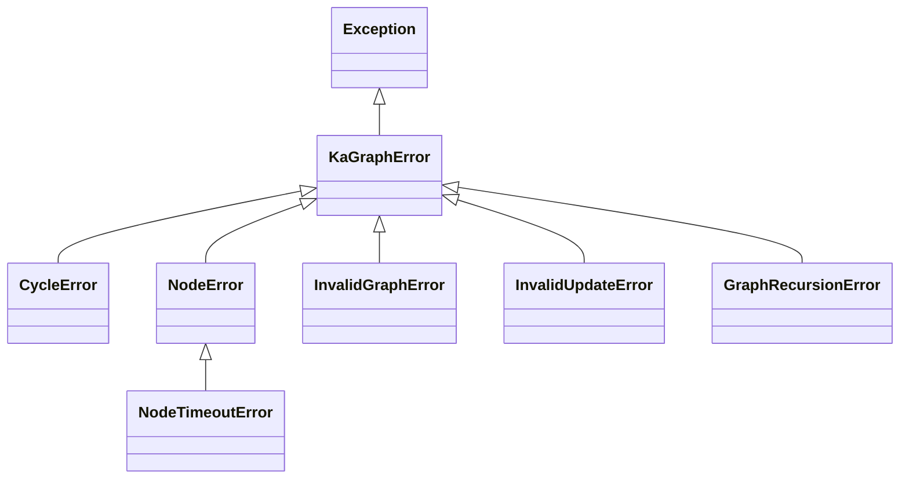

# Error Reference — `kagraph.errors`

## Source Map

| File | Description |
|---|---|
| `src/kagraph/errors.py` | All exception class definitions: `KaGraphError`, `CycleError`, `NodeError`, `NodeTimeoutError`, `InvalidGraphError`, `InvalidUpdateError`, `GraphRecursionError`. |
| `src/kagraph/__init__.py` | Re-exports all error classes from the top-level `kagraph` package. |
| `src/kagraph/graph/state.py` | Raises these exceptions during `validate()`, node execution, state update application, and recursion-limit enforcement. |
| `src/kagraph/types.py` | Defines `GraphInterrupt`, which is often confused with an error but is a control-flow signal. |

---

## Overview

All KaGraph exceptions inherit from `KaGraphError`. They are raised either during graph construction (e.g., `StateGraph.validate()`) or during graph execution (`invoke()`, `stream()`). Catching the base `KaGraphError` lets you handle any library-level failure in one place; catching specific subclasses lets you respond to particular failure modes.

All error classes are importable from both `kagraph.errors` and the top-level `kagraph` package.

```python
from kagraph import KaGraphError, NodeError, GraphRecursionError
# or equivalently:
from kagraph.errors import KaGraphError, NodeError, GraphRecursionError
```

---

## Exception Hierarchy



---

## Exception Reference

### `KaGraphError`

**Base class** for all KaGraph exceptions. Never raised directly.

```python
from kagraph import KaGraphError

try:
    app.invoke(input_data)
except KaGraphError as e:
    print(f'KaGraph error: {e}')
```

---

### `CycleError`

Raised by `StateGraph.validate()` when an **unconditional cycle** is detected in the graph — a loop with no conditional exit that would cause infinite execution.

**Important distinction:** only *unconditional* cycles are forbidden. *Conditional* cycles (implemented via `add_conditional_edges`) are permitted and are the standard pattern for agentic loops such as ReAct, self-reflection, and Tree of Thought.

**Example trigger:**

```python
from kagraph import StateGraph, CycleError

graph = StateGraph(MyState)
graph.add_node('a', fn_a)
graph.add_node('b', fn_b)
graph.add_edge('a', 'b')
graph.add_edge('b', 'a')   # unconditional back-edge → CycleError

try:
    app = graph.compile()
except CycleError as e:
    print(f'Cycle detected: {e}')
```

**Allowed pattern (conditional cycle):**

```python
def should_continue(state):
    return 'agent' if not state['done'] else 'end'

graph.add_conditional_edges('agent', should_continue, {'agent': 'agent', 'end': END})
# ✓ No CycleError — the loop has a conditional exit
```

---

### `NodeError`

Raised when a **node callable raises an unhandled exception** during graph execution. The original exception is wrapped so you can access it via `__cause__`.

```python
from kagraph import NodeError

try:
    app.invoke(input_data)
except NodeError as e:
    print(f'Node failed: {e}')
    print(f'Original cause: {e.__cause__}')
```

---

### `NodeTimeoutError`

Subclass of `NodeError`. Raised when a node **exceeds its configured `TimeoutPolicy.run_timeout`**.

> [!WARNING]
> Because synchronous Python callables cannot be safely interrupted mid-execution, `NodeTimeoutError` is raised *after* the callable returns, once the elapsed time is detected. It cannot enforce a hard wall-clock cut-off for blocking operations.

```python
from kagraph import TimeoutPolicy
from kagraph.errors import NodeTimeoutError

graph.add_node('slow_node', my_fn, timeout=TimeoutPolicy(run_timeout=5.0))

try:
    app.invoke(input_data)
except NodeTimeoutError as e:
    print(f'Node timed out: {e}')
```

---

### `InvalidGraphError`

Raised during `StateGraph.validate()` (or at compile time) when the **graph structure is invalid**.

**Common triggers:**

| Trigger | Description |
|---|---|
| No nodes added | The graph has no nodes |
| No edge from `START` | Nothing runs on the first step |
| Unknown edge endpoint | Edge source or destination names a node that doesn't exist |
| Unreachable node | A node is not reachable from `START` |
| `END` not reachable | No path from any node reaches `END` |
| Invalid node name | Node name contains `':'` (reserved for subgraph namespacing) |
| `START` / `END` as a node | Attempting to add the reserved sentinels as regular nodes |

```python
from kagraph import StateGraph, START, END
from kagraph.errors import InvalidGraphError

graph = StateGraph(MyState)
graph.add_node('process', my_fn)
graph.add_edge('process', 'nonexistent')  # ← references unknown node

try:
    app = graph.compile()
except InvalidGraphError as e:
    print(f'Graph structure error: {e}')
```

---

### `InvalidUpdateError`

Raised during execution when a **node returns a state update containing invalid keys or value types** that cannot be applied to the current state schema.

```python
from kagraph.errors import InvalidUpdateError

try:
    app.invoke(input_data)
except InvalidUpdateError as e:
    print(f'Bad state update from node: {e}')
```

**Common causes:**
- A node returns a dict with keys not present in the state schema.
- A node returns a value of the wrong type for a typed field.
- A reducer receives an incompatible value.

---

### `GraphRecursionError`

Raised when `invoke()` or `stream()` exceeds the configured **`recursion_limit`** — the maximum number of node execution steps per run.

**Default limit:** `100` steps.

**Configuration:**

```python
from kagraph import GraphRecursionError

try:
    result = app.invoke(input_data, recursion_limit=200)
except GraphRecursionError:
    print('Agent exceeded step limit — consider increasing recursion_limit')
```

> [!TIP]
> Increase `recursion_limit` for deeply looping agents such as Tree of Thought with large beam widths, multi-hop reasoning chains, or long ReAct loops. A reasonable upper bound for most production agents is 200–500.

> [!CAUTION]
> Setting `recursion_limit` very high without a `CycleError`-preventing conditional exit can cause runaway agents. Always ensure agentic loops have a well-defined termination condition.

---

## Error Handling Example

```python
from kagraph import (
    GraphRecursionError,
    NodeError,
    TimeoutPolicy,
)
from kagraph.errors import (
    InvalidGraphError,
    InvalidUpdateError,
    CycleError,
    NodeTimeoutError,
)

try:
    result = app.invoke(input_data, recursion_limit=50)

except CycleError as e:
    # Fix: add a conditional exit to the loop
    print(f'Unconditional cycle in graph: {e}')

except NodeTimeoutError as e:
    # Fix: increase timeout or optimize the slow node
    print(f'Node timed out: {e}')

except NodeError as e:
    # Fix: handle or suppress the exception inside the node
    print(f'Node raised an exception: {e}')
    print(f'Original error: {e.__cause__}')

except InvalidGraphError as e:
    # Fix: correct graph structure (edges, node names)
    print(f'Invalid graph: {e}')

except InvalidUpdateError as e:
    # Fix: ensure nodes return valid state keys/types
    print(f'Node returned bad state update: {e}')

except GraphRecursionError:
    # Fix: increase recursion_limit or add a termination condition
    print('Agent exceeded step limit — consider increasing recursion_limit')
```

---

## Note on `GraphInterrupt`

`GraphInterrupt` is **not** in `kagraph.errors` and does **not** inherit from `KaGraphError`. It lives in `kagraph.types` and is a **control-flow signal**, not an error — it is the mechanism by which `interrupt()` pauses a graph and awaits external (e.g., human) input before resuming.

```python
from kagraph import GraphInterrupt  # from kagraph.types, re-exported at top level

try:
    app.invoke(input_data, config=config)
except GraphInterrupt as e:
    # Not an error — the graph is waiting for human input
    print('Awaiting input:', e.value.value)
```

See the [Core Types](./types.md#graphinterrupt) documentation for full details.


