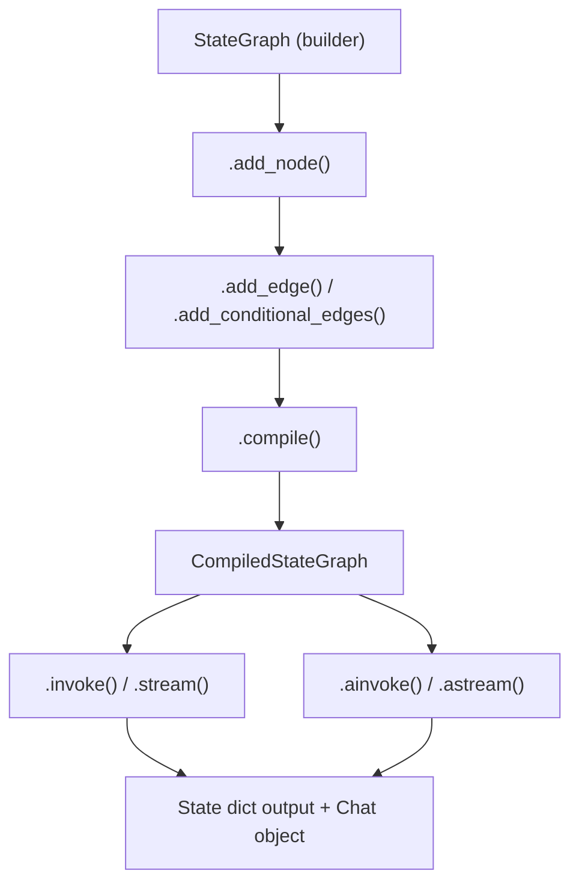

# KaGraph — Overview & Getting Started

KaGraph is a **LangGraph-compatible agent graph framework** built on top of `kaggle_benchmarks`. It provides a familiar graph-based API for constructing stateful, multi-node agentic workflows with native integration to the `kbench` LLM stack — designed to run directly inside Kaggle competition environments.

---

## What is KaGraph?

KaGraph lets you define agentic pipelines as a **directed graph** of nodes and edges, where:

- **Nodes** are plain Python functions that read from and write to a shared **State** dictionary.
- **Edges** route control flow between nodes, including conditional branching.
- **State** is accumulated across steps using typed reducer functions.
- **LLMs** are loaded via `kaggle_benchmarks` and invoked through KaGraph's prompting layer.

The graph is compiled into a `CompiledStateGraph` that can be executed synchronously (`invoke`, `stream`) or asynchronously (`ainvoke`, `astream`), optionally with **checkpointing** and **tracing**.

> [!IMPORTANT]
> KaGraph does **not** replace model objects. The LLM returned by `load_llm()` or `load_default_llm()` is the canonical `kaggle_benchmarks` `ModelProxy`/`LLMChat` — KaGraph simply provides the wiring around it.

---

## Key Design Philosophy

| Principle | Detail |
|-----------|--------|
| **No model wrapping** | LLM objects come from `kaggle_benchmarks` unchanged. KaGraph adds routing and state management, not a new model abstraction. |
| **Role-preserving messages** | Message lists retain their `role` field (`human`, `ai`, `system`, `tool`). Nothing is flattened to a single prompt string. |
| **Orphan chats for invocation** | Each LLM call creates an isolated temporary chat so the parent graph's chat history stays clean. |
| **LangGraph-compatible API** | `StateGraph`, `CompiledStateGraph`, `START`/`END`, `Command`, `Send`, and reducers follow the same interface as LangGraph, making code portable. |

---

## Core Concepts

| Concept | Description |
|---------|-------------|
| **StateGraph** | Builder class. You add nodes, edges, and conditional branches to define the graph topology. |
| **CompiledStateGraph** | Produced by `.compile()`. Runs the graph; supports `invoke`, `stream`, `ainvoke`, `astream`. |
| **Nodes** | Python callables `(state) -> dict`. Their return value is merged into the graph state. |
| **Edges** | Directed connections between nodes. `START` and `END` are special sentinels for entry and exit. |
| **State / Reducers** | A typed `TypedDict` (or `MessagesState`) describing the shared state. Fields may declare reducer functions (e.g. `add_messages`) to control how updates are merged. |
| **Messages** | `HumanMessage`, `AIMessage`, `SystemMessage`, `ToolMessage`, `FunctionMessage` — typed wrappers that preserve role semantics throughout the graph. |
| **LLMs** | Loaded via `load_llm()` / `load_default_llm()`. The resulting object is passed directly to `invoke_llm` / `prompt_llm`. |
| **Prompts** | `invoke_llm` and `prompt_llm` build temporary kbench chats, append messages, and call `llm.respond(...)`. `ChatPrompt` enables template-based prompting. |
| **Checkpointing** | `InMemorySaver` (and compatible backends) persist state snapshots after each node, enabling resumable and fault-tolerant execution. |
| **Tracing** | `KaTrace Studio` integration records node invocations, state diffs, and LLM calls for debugging and replay. |

---

## Module Overview

| Module | Purpose |
|--------|---------|
| `kagraph` | Top-level public API — re-exports the most commonly used symbols (`StateGraph`, `START`, `END`, message types, LLM helpers, etc.). |
| `kagraph.graph` | `StateGraph` builder and `CompiledStateGraph` execution engine. |
| `kagraph.messages` | Message type classes (`HumanMessage`, `AIMessage`, …) and reducer utilities (`add_messages`, `coerce_messages`). |
| `kagraph.prompts` | `invoke_llm`, `prompt_llm`, `ChatPrompt`, `MessagesPlaceholder` — the LLM invocation layer. |
| `kagraph.llms` | `load_llm()` and `load_default_llm()` — thin wrappers over `kaggle_benchmarks` model loading. |
| `kagraph.types` | `Command`, `Send`, `RetryPolicy`, and other control-flow/typing primitives. |
| `kagraph.prebuilt` | Drop-in components: `ToolNode`, `ValidationNode`, `tools_condition` edge helper. |
| `kagraph.checkpoint` | `InMemorySaver` and `StateSnapshot` — checkpointing infrastructure. |
| `kagraph.tracing` | KaTrace Studio integration for execution tracing and debugging. |
| `kagraph.images` | `ImageContent`, `ImageURL`, and helpers for attaching image payloads to LLM calls. |
| `kagraph.runtime` | Runtime context propagation (thread ID, config, run metadata). |
| `kagraph.errors` | Exception hierarchy (`KaGraphError`, `NodeError`, `CheckpointError`, etc.). |

---

## Quick Start

The following example shows the complete lifecycle: load an LLM, define a typed state, build the graph, compile it, and invoke it.

```python
from kagraph import START, END, StateGraph, MessagesState
from kagraph.llms import load_llm
from kagraph.prompts import invoke_llm
from kagraph.messages import HumanMessage

# 1. Load a model from the kaggle_benchmarks model registry
llm = load_llm("qwen/qwen3-235b-a22b-instruct-2507")

# 2. Define a node — receives state, returns a state update dict
def my_node(state: MessagesState):
    response = invoke_llm(llm, messages=state["messages"], prompt="Answer the user.")
    return {"messages": [response]}

# 3. Build the graph topology
graph = StateGraph(MessagesState)
graph.add_node("my_node", my_node)
graph.add_edge(START, "my_node")
graph.add_edge("my_node", END)

# 4. Compile into a runnable
app = graph.compile()

# 5. Invoke with an initial state
result = app.invoke({"messages": [HumanMessage("Hello!")]})
print(result["messages"][-1].content)
```

> [!TIP]
> `MessagesState` is a built-in state schema with a single `messages` field using the `add_messages` reducer, which appends new messages instead of overwriting the list.

---

## Graph Lifecycle



**Step-by-step:**

1. **Define** the graph with `StateGraph(schema)` — declare your state schema.
2. **Add nodes** via `.add_node(name, fn)` — each node is a pure Python function.
3. **Add edges** via `.add_edge(src, dst)` or `.add_conditional_edges(src, router_fn, mapping)` for branching.
4. **Compile** with `.compile(checkpointer=..., interrupt_before=..., interrupt_after=...)` to produce a `CompiledStateGraph`.
5. **Run** using `.invoke(state)` (blocking, returns final state) or `.stream(state)` (yields intermediate state diffs per node).

---

## Further Reading

| Topic | File |
|-------|------|
| Loading LLMs | [llms.md](./llms.md) |
| Prompting & LLM Invocation | [prompts.md](./prompts.md) |
| Messages & Message Types | [messages.md](./messages.md) |
| Core Types & Control Flow | [types.md](./types.md) |
| Error Reference | [errors.md](./errors.md) |
| Building Graphs (StateGraph) | [state_graph.md](./state_graph.md) |
| Running Graphs (CompiledStateGraph) | [compiled_graph.md](./compiled_graph.md) |
| State Persistence & Checkpointing | [checkpoint.md](./checkpoint.md) |
| Prebuilt Nodes & Utilities | [prebuilt.md](./prebuilt.md) |
| Runtime Context | [runtime.md](./runtime.md) |
| Image Handling | [images.md](./images.md) |
| Graph Visualization | [visualization.md](./visualization.md) |
| Advanced Node Configuration | [node_configuration.md](./node_configuration.md) |
| Tracing System | [tracing.md](./tracing.md) |
| Webapp Overview | [webapp/overview.md](./webapp/overview.md) |
| Webapp Backend | [webapp/backend.md](./webapp/backend.md) |
| Webapp Frontend | [webapp/frontend.md](./webapp/frontend.md)
